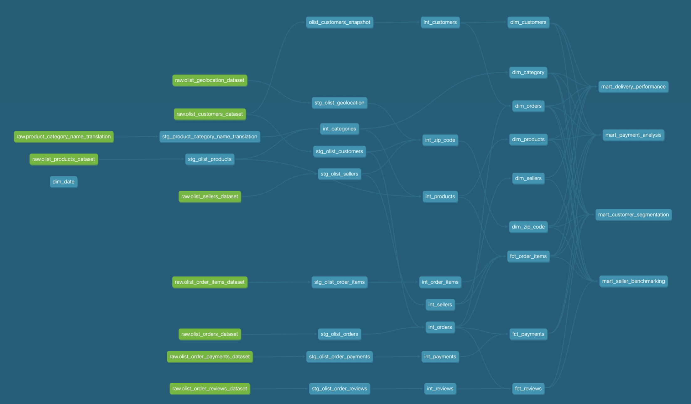
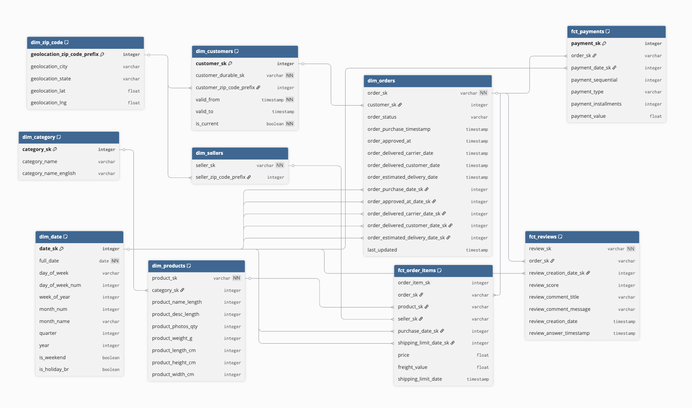
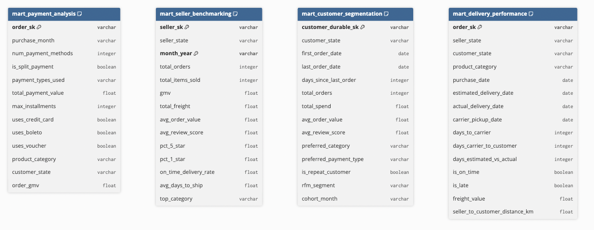

# Olist pipeline 
This repository contains an end-to-end ELT pipeline and aims to mimic industry-level data engineering concepts.

## Quick Overview

| Pipeline Component | Implementation | Notes |
|---|---|---|
| Data Source | CSV files (local) | Publicly available Olist Dataset |
| Data Ingestion | `snowflake-connector-python` | In production, tools such as Fivetran or Airbyte can be used instead. |
| Data Warehouse & Compute | Snowflake | Serves as both the storage layer and compute engine for query execution. |
| Data Transformation | SQL via dbt (CLI) | Transformations are written in SQL and managed through dbt, enabling version-controlled, modular data models. |


## About the Dataset
The dataset used contains ~100k anonymised Brazilian e-commerce transactions from Olist's marketplace platform (2016–2018), spanning the full order lifecycle including orders, customers, products, sellers, payments, and reviews.

## Business Applications of this Pipeline
- Customer Segmentation
- Delivery Performance
- Payment Analysis
- Seller Benchmarking

Each business application corresponds to a table in the final marts layer. This is to allow for end users to efficiently query this data.

## About the Repository

Below diagram provides an overview of the repository organisation.

```
olist-data-modelling/
├── eda/                  # Exploratory data analysis is performed to ensure understanding of the dataset in `EDA_pandas.ipynb`
|                         # Contains `Olist Raw Data Schema.csv` with consolidated row level findings
├── extract_load/         # Contains python scripts for raw data ingestion and schema creation in Snowflake 
├── transform/            # Contains dbt transformation scripts
├── docs/                 # Contains assets used in README.md
├── main.py               # File to run data ingestion process
├── dbt_project.yml       # File specifying configurations for dbt, to also identify the directory as a dbt project
├── config.env.example    # Sample of `config.env` that is required for customisation before usage
├── profiles.yml.example  # Sample of `profiles.yml` which dbt requires for configuring warehouse access and schema naming
|
# Untracked folders and files
├── data/                 # Contains 9 Olist CSV files 
├── logs/                 # This directory is automatically created for local log storing
|                         # This directory also contains rows that are rejected during the ELT process
├── dbt_packages/         # Required libraries installed by dbt cli
├── target/               # Directory created by dbt cli 
├── venv/                 # Python virtual environment
├── profiles.yml          # Contains the dbt profiles for version control and credentials to access Snowflake 
└── logs                  # External packages
```

# Data Pipeline Design Decisions

## Raw Dataset Limitations
Raw Olist dataset does not track changing dimensions. Below table shows the limitations and my approach
| Affected Table | Limitation | My approach |
|---|---|---|
| `customer` | Table has duplicate `customer_id` key because `customer_zip_code_prefix` changes for each unique customer (based on `customer_unique_id` key) | SCD (Type 2) is implemented for this table using snapshots functionality in dbt |
| `orders` | Updates are in-place: existing delivered status is overwritten and `delivered_datetime` column is populated. | This data pipeline does not account for changes in this table and is a one-time bulk ingestion | 

## Cost Management
| Component | Cost | Solution |
|---|---|---|
| Compute (Snowflake) | 1 credit/hr for XS warehouse (WH); 2 credits/hr for Small WH. | XS WH is used and configured to auto-suspend after 60 seconds of inactivity | 
| Storage (Snowflake) | Charged monthly at ~$23/TB/month on-demand | This a relatively insignificant amount especially for Olist dataset | 

## Data Management

### Data Materialisation Options
There are three materialisation options for data tables provided when using dbt, shown in the table below.

| Materialisation | dbt implementation | Snowflake implementation | Description | Application |
|---|---|---|---|---|
| Table | dbt runs `CREATE OR REPLACE TABLE AS SELECT` | Table in Snowflake | Physical data is stored | When queried by BI tools or end users |
| View | dbt runs `CREATE OR REPLACE VIEW` | Non materialised standard view | No physical data is stored, only the query logic is | To encapasulate complex SQL logic in one query without using physical storage |
| Ephermeral | dbt injects query logic as CTE to downstream dbt models | Nothing is created in Snowflake | Query exists only in compiled SQL (cannot be queried) | For simple intermediate tables that do not require its own materialisation. Use if compile time is a bottle neck in dbt |


### Layered-modelling / Medallion Architecture
For my data pipeline, I follow a layered-modelling architecure, also known as medallion architecture.

| Layer | Materialised Type | Rationale |
|---|---|---|
| Staging | View | 1-1 mapping to raw data, one-time loaded to Snowflake | 
| Intermediate | View or Tables depending on complexity | Simple tables with minimal data transformation are kept as Views to reduce storage cost and data deduplication |
| Marts | Tables | Marts will be queried most. Tables allow for efficient querying |

## dbt 

### dbt Project Structure
This is initialised by running `dbt init transform` in the `transform` folder. This command automatically creates the below firstt layer of directories.

```
transform/
├── models/               # SQL transformation logic is in this folder
│   ├── staging/          # Staging (stg_) models
│   └── intermediate/     # Intermediate (int_) models (joins, business logic)
│   └── marts/            
│       ├── core/         # Fact (fct_) and Dimension (dim_) models
│       └── business/     # Mart (mart_) models (for end users)
├── tests/                # Custom tests to ensure data validity
├── macros/               # Contains reusable SQL query across models
├── seeds/
└── snapshots/            # Contains snapshot definitions for SCD Type 2 implementation
```

### dbt Data Lineage


### dbt Implementation
- There is only one developer (myself) on this project, and there is therefore only one dev environment
- The same role that ingestions data to the raw schema is used to transform the data

## Data Pipeline

1. Ingestion to `raw` schema:
  - Snowflake Python connector in `ingestion_raw.py`. In production, this can be replaced with ingestion tools such as Fivetran or Airbyte to ensure immutability
  - Note:
    - raw tables do not have any transformation and is a 1-1 mapping of the source data
    - All columns are ingested as varchar to ensure COPY INTO does not fail due to a schema mismatch
    - Non null columns are not enforced here

2. `stg` models are still a 1-1 mapping of `raw` tables with only data integrity based cleaning rules applied 
  - Transformations in this step should be **reversible** and **not requiring specific business judgement** 
    - E.g. 1. Upper casing of `state` column is reversible and matches Brazilian postal authority standards. The casing does not contain business meaning pertaining to Olist.
    - E.g. 2. Cleaning `city` column to match equivalence across tables is non-reversible and is a business decision about equivalence, i.e. 'são paulo' and 'sao paulo' being the same entity serves a specific business purpose and does NOT belong in staging.
  - No PII masking required for this dataset

3. Build intermediate tables
  - Surrogate keys are generated here 
  - Business logic is applied here:
      - E.g. 1. Add "uncategorised" as a new category
      - E.g. 2. Datetime validity (e.g. based on order_status) and order_status validility
  - Transformations here are deterministic and implemented to avoid repetition or redundancy of business logic in marts layer and BI reports. This also ensures consistency and a single source of truth.
  - Each intermediate table has a clear purpose
  - Some tables are clean enough that do not require this intermediate layer
  - May have normalisation of tables

4. Business Core Layer
  - Degenerate dimensions included
  - Star schema (with fact and dimension tables) are used. Note that dimensions tables are built before fact tables due to foreign key referential dependencies
  - Business Core ERD:
    

5. Business Mart layer
    a. Products Table
    b. Customer x Products Table
  - Business Mart ERD:
    

# How to run

## Pre-requisites
1. Snowflake Account is required.

## Steps
1. Run `olist_wh_setup.sql` to set up Snowflake Warehouse, Database, Role and User
2. Rename `config.env.example` in the root directory to `config.env` and populate the relevant credentials. 
- This is for ingestion
3. Rename `profiles.yml.example` in the root directory to `profiles.yml` and populate the relevant credentials. 
- This is for dbt

## Steps
1. Ensure Python is installed
2. Create Python virtual environment with `python -m venv venv`
3. Run `pip install requirements.txt`
4. Run `dbt deps`
5. Run `python main.py` : to load raw data tables to Snowflake
6. Run `dbt debug`: tests that connection to Snowflake works
7. Run `dbt snapshot`
8. Run `dbt run`: load tables
9. Run `dbt test`: run tests


# Citations
Olist, and André Sionek. (2018). Brazilian E-Commerce Public Dataset by Olist [Data set]. Kaggle. https://doi.org/10.34740/KAGGLE/DSV/195341 